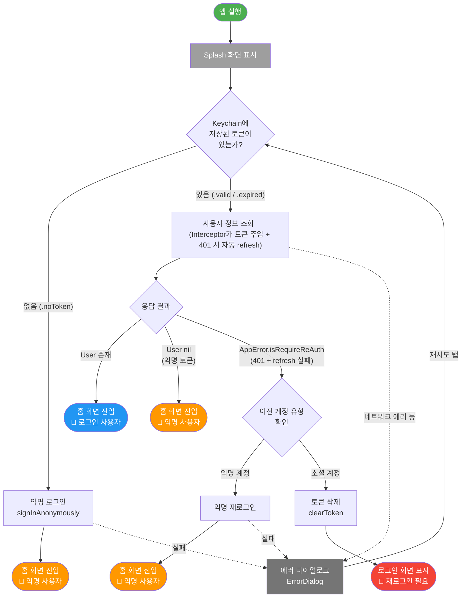
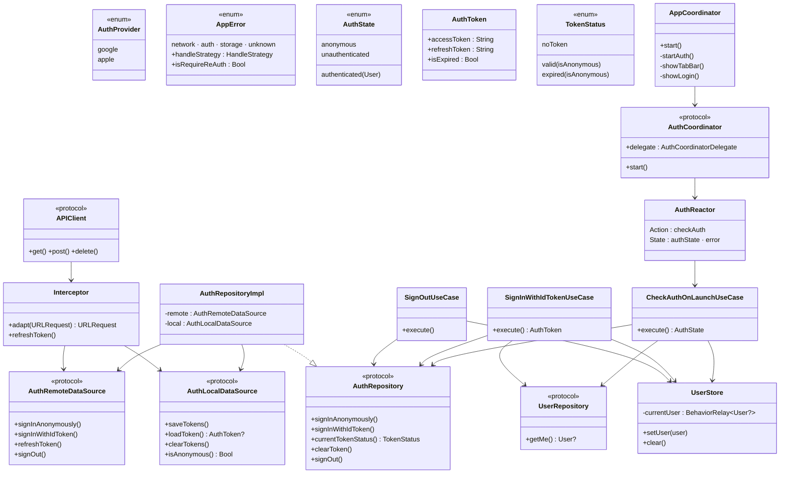
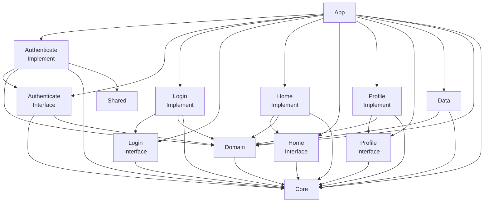

# Auth 설계 문서

## 1. 개요

| 항목 | 내용 |
|------|------|
| **작성일** | 2026-03-04 |
| **문서버전** | v1.0 |
| **작성자** | Sangjin Lee |

앱 실행 시 Keychain 토큰 상태를 기반으로 익명/로그인/미인증 상태를 판별하고, 소셜 로그인(Google, Apple) 및 익명 세션을 관리하는 인증 기능이다.
토큰 갱신(refresh)은 Interceptor + APIClient 레벨에서 투명하게 처리되며, 갱신 실패 시 계정 유형에 따라 익명 재로그인 또는 로그인 화면 이동으로 분기한다.

---

## 2. 플로우차트



앱 실행 시 `CheckAuthOnLaunchUseCase`가 Keychain 토큰 상태를 확인하고, 토큰 유무 및 GET /me 응답에 따라 `AuthState`(anonymous / authenticated / unauthenticated)를 결정한다.
`AppCoordinator`는 이 결과를 받아 홈 화면(anonymous, authenticated) 또는 로그인 화면(unauthenticated)으로 분기하며, 네트워크 에러 등 실패 시 `ErrorDialog`를 통해 재시도할 수 있다.

---

## 3. iOS 클라이언트 구조

### 3.1 클래스 다이어그램

Auth 기능에 관여하는 주요 클래스와 의존 관계를 레이어별로 나타낸 다이어그램이다.



### 3.2 모듈 간 의존 관계

Tuist 기반 멀티 모듈 구조에서 Auth 기능과 관련된 모듈 의존 그래프이다.



### 3.3 주요 클래스/파일 목록과 역할

#### Core 레이어

| 파일 | 클래스/타입 | 역할 |
|------|------------|------|
| `Core/Sources/Store/UserStore.swift` | `UserStore` | `BehaviorRelay<User?>`로 앱 전역 사용자 상태 관리 |
| `Core/Sources/Store/AuthProvider.swift` | `AuthProvider` (enum) | 소셜 로그인 제공자 식별 (`google`, `apple`) |
| `Core/Sources/Error/AppError.swift` | `AppError` (enum) | 통합 에러 타입. `handleStrategy`로 UI 처리 전략 결정 |
| `Core/Sources/Error/AuthErrorType.swift` | `AuthErrorType` (enum) | `sessionExpired`, `invalidCredentials`, `providerFailed`, `rateLimited` |
| `Core/Sources/UI/ErrorDialog.swift` | `ErrorDialog` | `AppError.handleStrategy` 기반으로 에러 다이얼로그 표시 |

#### Domain 레이어

| 파일 | 클래스/타입 | 역할 |
|------|------------|------|
| `Domain/Sources/Entity/Auth/AuthState.swift` | `AuthState` (enum) | 앱 인증 상태: `anonymous` / `authenticated(User)` / `unauthenticated` |
| `Domain/Sources/Entity/Auth/AuthToken.swift` | `AuthToken` | JWT 토큰 보관. `isExpired` 프로퍼티로 만료 판별 |
| `Domain/Sources/Entity/Auth/TokenStatus.swift` | `TokenStatus` (enum) | 토큰 평가 결과: `noToken` / `valid` / `expired` |
| `Domain/Sources/Repository/Auth/AuthRepository.swift` | `AuthRepository` (protocol) | 인증 관련 Repository 인터페이스 |
| `Domain/Sources/Usecase/Auth/CheckAuthOnLaunchUseCase.swift` | `CheckAuthOnLaunchUseCaseImpl` | 앱 실행 시 인증 상태 판별 (핵심 로직) |
| `Domain/Sources/Usecase/Auth/SignInWithIdTokenUseCase.swift` | `SignInWithIdTokenUseCaseImpl` | 소셜 로그인: idToken → Supabase 인증 → 유저 조회 |
| `Domain/Sources/Usecase/Auth/SignOutUseCase.swift` | `SignOutUseCaseImpl` | 로그아웃: SDK + Supabase 로그아웃 → 익명 전환 |
| `Domain/Sources/Util/JWTDecoder.swift` | `JWTDecoder` | JWT payload의 `exp` claim으로 토큰 만료 판별 |

**핵심 코드 - CheckAuthOnLaunchUseCase.execute()**

앱 실행 시 인증 상태를 결정하는 핵심 로직이다. 토큰 유무 → GET /me → 에러 복구 순으로 분기한다.

```swift
public func execute() async throws -> AuthState {
    // 1. 토큰 없음 → 익명 로그인
    if case .noToken = authRepository.currentTokenStatus() {
        _ = try await authRepository.signInAnonymously()
        userStore.clear()
        return .anonymous
    }

    // 2. 토큰 있음 → GET /me (인터셉터가 토큰 주입 + 401 리프레시)
    do {
        if let user = try await userRepository.getMe() {
            userStore.setUser(user)
            return .authenticated(user)
        } else {
            userStore.clear()
            return .anonymous
        }
    } catch let error as AppError where error.isRequireReAuth {
        // 3. 401 (리프레시도 실패) → 계정 유형에 따라 분기
        userStore.clear()
        switch authRepository.currentTokenStatus() {
        case .valid(let isAnonymous), .expired(let isAnonymous):
            if isAnonymous {
                _ = try await authRepository.signInAnonymously()
                return .anonymous
            }
            try authRepository.clearToken()
            return .unauthenticated

        case .noToken:
            _ = try await authRepository.signInAnonymously()
            return .anonymous
        }
    }
}
```

#### Data 레이어

| 파일 | 클래스/타입 | 역할 |
|------|------------|------|
| `Data/Sources/DataSource/Remote/AuthRemoteDataSource.swift` | `AuthRemoteDataSourceImpl` | Supabase Auth API 호출 (로그인/로그아웃/리프레시) |
| `Data/Sources/DataSource/Local/AuthLocalDataSource.swift` | `AuthLocalDataSourceImpl` | Keychain에 토큰 저장/조회/삭제 |
| `Data/Sources/DataSource/Remote/UserRemoteDataSource.swift` | `UserRemoteDataSourceImpl` | 사용자 정보 조회 API 호출 |
| `Data/Sources/Client/APIClient.swift` | `APIClientImpl` | HTTP 요청 수행 + 401 시 토큰 리프레시 후 1회 재시도 |
| `Data/Sources/Client/Interceptor.swift` | `Interceptor` | 요청 헤더 주입 (Authorization, apikey) + 토큰 리프레시 |
| `Data/Sources/Mapper/Error/SupabaseErrorMapper.swift` | `SupabaseErrorMapper` | Supabase `AuthError` → `AppError` 매핑 |

**핵심 코드 - APIClient 401 자동 재시도**

모든 API 호출에서 401 응답 시 자동으로 토큰을 갱신하고 1회 재시도한다. 호출자는 토큰 만료를 신경 쓸 필요가 없다.

```swift
// APIClient.swift
private func request(endpoint:method:body:) async throws -> Data {
    // ... URLRequest 생성 + interceptor.adapt(헤더 주입) ...
    switch httpResponse.statusCode {
    case 200...299:
        return data
    case 401:
        return try await retryAfterRefresh(urlRequest)  // ← 자동 갱신
    case 404:
        throw AppError.network(.notFound)
    case 500...599:
        throw AppError.network(.serverError(statusCode: httpResponse.statusCode))
    // ...
    }
}

private func retryAfterRefresh(_ originalRequest: URLRequest) async throws -> Data {
    try await interceptor.refreshToken()        // refreshToken으로 새 accessToken 발급
    var retryRequest = originalRequest
    retryRequest = interceptor.adapt(retryRequest)  // 새 토큰으로 헤더 재주입
    // ... 재요청, 실패 시 AppError.auth(.sessionExpired) throw
}
```

**핵심 코드 - Interceptor**

모든 요청에 인증 헤더를 주입하고, 토큰 갱신을 담당한다.

```swift
// Interceptor.swift
func adapt(_ request: URLRequest) -> URLRequest {
    var request = request
    if let token = localDataSource.loadToken() {
        request.setValue("Bearer \(token.accessToken)", forHTTPHeaderField: "Authorization")
    }
    request.setValue(apiKey, forHTTPHeaderField: "apikey")
    request.setValue("application/json", forHTTPHeaderField: "Content-Type")
    return request
}

func refreshToken() async throws {
    guard let token = localDataSource.loadToken() else {
        throw AppError.auth(.sessionExpired)
    }
    let response = try await remoteDataSource.refreshToken(token.refreshToken)
    try localDataSource.saveTokens(accessToken: response.accessToken,
                                   refreshToken: response.refreshToken)
}
```

#### Feature 레이어 (Authenticate)

| 파일 | 클래스/타입 | 역할 |
|------|------------|------|
| `Features/Authenticate/.../AuthCoordinatorImpl.swift` | `AuthCoordinatorImpl` | Splash 표시 → AuthReactor 구독 → delegate 호출 |
| `Features/Authenticate/.../AuthReactor.swift` | `AuthReactor` (ReactorKit) | `.checkAuth` 액션 → UseCase 실행 → 상태 업데이트 |
| `Features/Authenticate/.../SplashViewController.swift` | `SplashViewController` | Splash UI (인증 확인 중 표시) |

**핵심 코드 - AuthCoordinatorImpl.start()**

Splash를 표시하고, ReactorKit 패턴으로 인증 결과와 에러를 구독한다.

```swift
public func start() {
    let splashVC = SplashViewController()
    navigationController.setViewControllers([splashVC], animated: false)

    // 인증 상태 확정 → delegate로 AppCoordinator에 전달
    authReactor.state.map(\.authState)
        .compactMap { $0 }
        .take(1)
        .observe(on: MainScheduler.instance)
        .subscribe(onNext: { [weak self] state in
            self?.delegate?.authDidCheckOnLaunch(state: state)
        })
        .disposed(by: disposeBag)

    // 에러 → ErrorDialog (재시도 가능)
    authReactor.state.map(\.error)
        .compactMap { $0 }
        .observe(on: MainScheduler.instance)
        .subscribe(onNext: { [weak self] error in
            guard let self else { return }
            ErrorDialog.show(on: splashVC, error: error,
                             retryAction: { self.authReactor.action.onNext(.checkAuth) })
        })
        .disposed(by: disposeBag)

    authReactor.action.onNext(.checkAuth)
}
```

---

## 4. 백엔드

### 4.1 스키마

<!-- Supabase 대시보드에서 users 테이블 스크린샷으로 교체 예정 -->

**users 테이블**

| 컬럼 | 타입 | 설명 |
|------|------|------|
| `id` | `uuid` (PK) | Supabase Auth UID와 동일 |
| `nickname` | `text` | 사용자 닉네임 |
| `profile_url` | `text` (nullable) | 프로필 이미지 URL |
| `provider` | `text` | 로그인 제공자 (`google`, `apple`) |
| `created_at` | `timestamptz` | 생성일시 |

> RLS(Row Level Security) 활성화: `auth.uid() = id` 조건으로 본인 데이터만 조회 가능

### 4.2 API

| 메서드 | 엔드포인트 | 설명 | 인증 |
|--------|-----------|------|------|
| `POST` | Supabase Auth: `signInAnonymously` | 익명 세션 생성 | 불필요 |
| `POST` | Supabase Auth: `signInWithIdToken` | 소셜 로그인 (Google/Apple idToken) | 불필요 |
| `POST` | Supabase Auth: `setSession` | refreshToken으로 토큰 갱신 | refreshToken |
| `POST` | Supabase Auth: `signOut` | 세션 종료 | accessToken |
| `GET` | $Screts.API_ME 참고 | 현재 로그인된 사용자 정보 조회 | Bearer Token + apikey |

> Auth 관련 API는 Supabase SDK를 통해 호출하며, 사용자 정보 조회 API만 `APIClient`를 통해 직접 호출한다.

---

## 5. 알려진 이슈 / TODO

| 상태 | 항목 | 설명 |
|------|------|------|
| TODO | Apple 로그인 연동 | `AuthRemoteDataSource.signOut()`에서 Apple 케이스 미구현 |
| TODO | 계정 삭제 | `deleteAccount()` 백엔드 Edge Function 미구현 |
