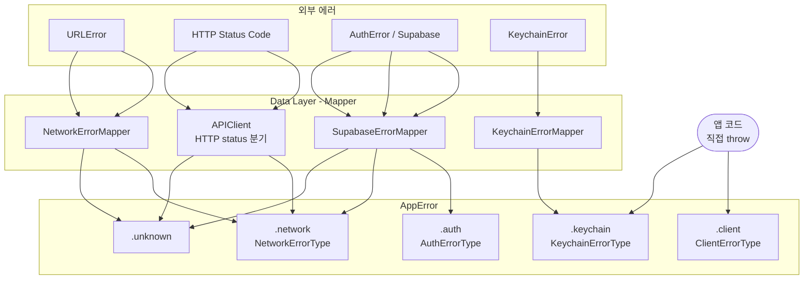
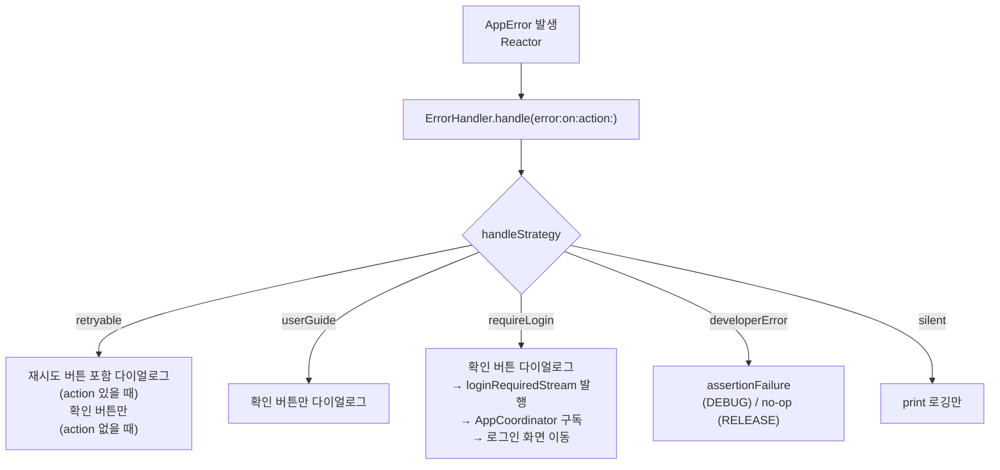

# Error Protocol 설계 문서

## 1. 개요

| 항목 | 내용 |
|------|------|
| **작성일** | 2026-04-21 |
| **문서버전** | v1.0 |
| **작성자** | Sangjin Lee |

Data Layer에서 발생하는 모든 에러를 `AppError`로 통일하고, `ErrorHandler`를 단일 진입점으로 삼아 UI 처리 전략을 일관성 있게 적용하는 에러 프로토콜이다.

각 레이어의 책임:
- **Data Layer**: 외부 에러(URLError, AuthError, KeychainError)를 `AppError`로 변환
- **Domain / Feature Layer**: `AppError`만 수신하며, 에러 종류를 판단하지 않음
- **ErrorHandler**: `AppError.handleStrategy`에 따라 UI 표시 / 로깅 / 재인증 이벤트 발행

---

## 2. Error 정의

### 2.1 Data Layer 원시 에러

Data Layer에서 발생할 수 있는 외부 에러 목록이다. 이 에러들은 반드시 Mapper를 통해 `AppError`로 변환된다.

#### URLError (네트워크)

| URLError.Code | 발생 시점 |
|--------------|----------|
| `notConnectedToInternet` | 인터넷 연결 없음 |
| `networkConnectionLost` | 요청 중 연결 끊김 |
| `timedOut` | 요청 시간 초과 |
| `cancelled` | 요청 취소 |
| `secureConnectionFailed` 외 SSL 관련 | SSL/TLS 핸드셰이크 실패 |
| `cannotDecodeRawData` 외 파싱 관련 | 응답 디코딩 실패 |

#### HTTP Status Code (APIClient)

| Status Code | 발생 시점 |
|------------|----------|
| `400` | 잘못된 요청 파라미터 |
| `401` | 인증 토큰 없음 / 만료 → retryAfterRefresh 후 재발생 시 |
| `404` | 존재하지 않는 리소스 |
| `409` | 서버 비즈니스 로직 충돌 (body의 `error` 필드로 세부 코드 파싱) |
| `429` | 요청 빈도 초과 |
| `5xx` | 서버 내부 오류 |

#### AuthError (Supabase SDK)

| AuthError | 발생 시점 |
|----------|----------|
| `sessionMissing` | 세션 없음 |
| `jwtVerificationFailed` | JWT 검증 실패 |
| `pkceGrantCodeExchange`, `implicitGrantRedirect` | OAuth Provider 인증 실패 |
| `.api(errorCode: .invalidCredentials)` | 잘못된 인증 정보 |
| `.api(errorCode: .sessionNotFound / .sessionExpired 외)` | 세션/토큰 만료 |
| `.api(errorCode: .signupDisabled / .anonymousProviderDisabled)` | Provider 비활성화 |
| `.api(errorCode: .overRequestRateLimit 외)` | 요청 빈도 초과 |

#### KeychainError

| KeychainError | 발생 시점 |
|--------------|----------|
| `saveFailed(OSStatus)` | `SecItemAdd` / `SecItemUpdate` 실패 |
| `deleteFailed(OSStatus)` | `SecItemDelete` 실패 |


### 2.2 AppError

Data Layer의 모든 에러가 수렴하는 통합 에러 타입이다.

```swift
public enum AppError: Error, Equatable {
    case network(NetworkErrorType)
    case auth(AuthErrorType)
    case keychain(KeychainErrorType)
    case client(ClientErrorType)
    case unknown(message: String)
}
```

#### NetworkErrorType

| case | 설명 |
|------|------|
| `notConnected` | 인터넷 연결 없음 |
| `timeout` | 요청 시간 초과 |
| `connectionLost` | 연결 끊김 |
| `cancelled` | 요청 취소 |
| `sslError` | SSL/TLS 오류 |
| `badRequest` | HTTP 400 |
| `conflict(ServerErrorCode)` | HTTP 409 + 서버 에러 코드 |
| `rateLimited` | HTTP 429 |
| `notFound` | HTTP 404 |
| `serverError(statusCode:)` | HTTP 5xx |
| `invalidResponse` | 응답 파싱 실패 |

#### AuthErrorType

| case | 설명 |
|------|------|
| `sessionExpired` | 세션 만료 / JWT 검증 실패 |
| `invalidCredentials` | 잘못된 인증 정보 |
| `providerFailed` | 소셜 Provider(Google/Apple) 오류 |
| `rateLimited` | 인증 요청 빈도 초과 |

#### KeychainErrorType

| case | 설명 |
|------|------|
| `saveFailed` | 키체인 저장 실패 |
| `loadFailed` | 키체인 읽기 실패 |
| `deleteFailed` | 키체인 삭제 실패 |
| `notFound` | 키체인에 토큰 없음 |

#### ClientErrorType

앱 코드에서 직접 throw하는 클라이언트 에러. Data Layer Mapper 불필요.

| case | 설명 |
|------|------|
| `imageSizeLimitExceeded` | 이미지 크기 10MB 초과 |
| `photoLibraryAccessDenied` | 앨범 접근 권한 없음 |
| `invalidImageFormat` | 지원하지 않는 이미지 형식 |

#### ServerErrorCode

HTTP 409 응답 시 서버 body의 `error` 필드로 전달되는 비즈니스 에러 코드.

| case | rawValue | 설명 |
|------|---------|------|
| `influencerConflict` | `"influencer.conflict"` | 이미 등록된 인플루언서 |
| `unknown` | — | 알 수 없는 서버 에러 코드 |

---

## 3. 플로우차트

### 3.1 Data Layer → AppError 매핑



### 3.2 AppError → ErrorHandler 처리



---

## 4. 에러 핸들링

### 4.1 HandleStrategy 전략표

| AppError | HandleStrategy | 사용자 안내 |
|---------|---------------|------------|
| `.network(.notConnected)` | retryable | 네트워크 연결을 확인해주세요. |
| `.network(.timeout)` | retryable | 요청 시간이 초과되었습니다. 다시 시도해주세요. |
| `.network(.connectionLost)` | retryable | 연결이 끊겼습니다. 다시 시도해주세요. |
| `.network(.serverError)` | userGuide | 서버 오류가 발생했습니다. 잠시 후 다시 시도해주세요. |
| `.network(.rateLimited)` | userGuide | 요청이 너무 많습니다. 잠시 후 다시 시도해주세요. |
| `.network(.conflict)` | userGuide | ServerErrorCode.message |
| `.network(.notFound)` | developerError | — (assert) |
| `.network(.invalidResponse)` | developerError | — (assert) |
| `.network(.badRequest)` | developerError | — (assert) |
| `.network(.sslError)` | developerError | — (assert) |
| `.network(.cancelled)` | silent | — (로깅) |
| `.auth(.sessionExpired)` | requireLogin | 세션이 만료되었습니다. 다시 로그인해주세요. |
| `.auth(.invalidCredentials)` | requireLogin | 인증 정보가 올바르지 않습니다. 다시 로그인해주세요. |
| `.auth(.providerFailed)` | userGuide | 인증 처리 중 오류가 발생했습니다. 다시 로그인해주세요. |
| `.auth(.rateLimited)` | userGuide | 요청이 너무 많습니다. 잠시 후 다시 시도해주세요. |
| `.keychain(.notFound)` | requireLogin | 로그인 정보를 찾을 수 없습니다. 다시 로그인해주세요. |
| `.keychain(.saveFailed)` | userGuide | 인증 정보를 저장하는데 실패했습니다. 기기 저장 공간을 확인하거나 앱을 재시작해주세요. |
| `.keychain(.loadFailed)` | silent | — (로깅) |
| `.keychain(.deleteFailed)` | silent | — (로깅) |
| `.client(...)` | userGuide | ClientErrorType.message |
| `.unknown` | silent | — (로깅) |

> **developerError**: 정상적인 서비스 환경에서 발생해선 안 되는 에러. DEBUG에서는 `assertionFailure`로 즉시 발견, RELEASE에서는 no-op으로 조용히 처리.

> **keychain(.loadFailed) / keychain(.deleteFailed)**: 기기 잠금 상태 백그라운드 접근 또는 키체인 DB 손상 시 발생. 앱 포그라운드 사용 중 빈도 극히 낮음. 토큰이 없으면 어차피 401 → retryAfterRefresh → `.auth(.sessionExpired)` 흐름으로 귀결됨.

### 4.2 Mapper 파일 목록

| 파일 | 입력 | 출력 |
|------|------|------|
| `NetworkErrorMapper` | `URLError` | `AppError` |
| `SupabaseErrorMapper` | `AuthError` (Supabase SDK) | `AppError` |
| `KeychainErrorMapper` | `KeychainError` | `AppError` |
| `APIClient` (내부) | HTTP Status Code | `AppError` |

### 4.3 ErrorHandler

```swift
// AppCore/Sources/Error/ErrorHandler.swift
public enum ErrorHandler {
    /// requireLogin 에러 발생 시 전역으로 이벤트를 발행한다.
    /// AppCoordinator에서 구독하여 로그인 화면으로 이동 처리.
    public static let loginRequiredStream = PublishSubject<Void>()

    /// 모든 화면에서 에러 처리 시 이 메서드를 통해 처리한다.
    public static func handle(
        error: AppError,
        on viewController: UIViewController,
        action: (() -> Void)? = nil
    )
}
```

각 화면(ViewController)은 Reactor의 `$error` pulse를 구독하여 `ErrorHandler.handle()`을 호출하며, 재시도가 의미 있는 화면에서는 `action`에 Reactor Action을 전달한다.

```swift
// ViewController 공통 패턴
reactor.pulse(\.$error)
    .compactMap { $0 }
    .observe(on: MainScheduler.instance)
    .subscribe(onNext: { [weak self] error in
        guard let self else { return }
        ErrorHandler.handle(error: error, on: self, action: {
            reactor.action.onNext(.retry)  // 재시도 액션 (화면에 따라 생략 가능)
        })
    })
    .disposed(by: self.disposeBag)
```